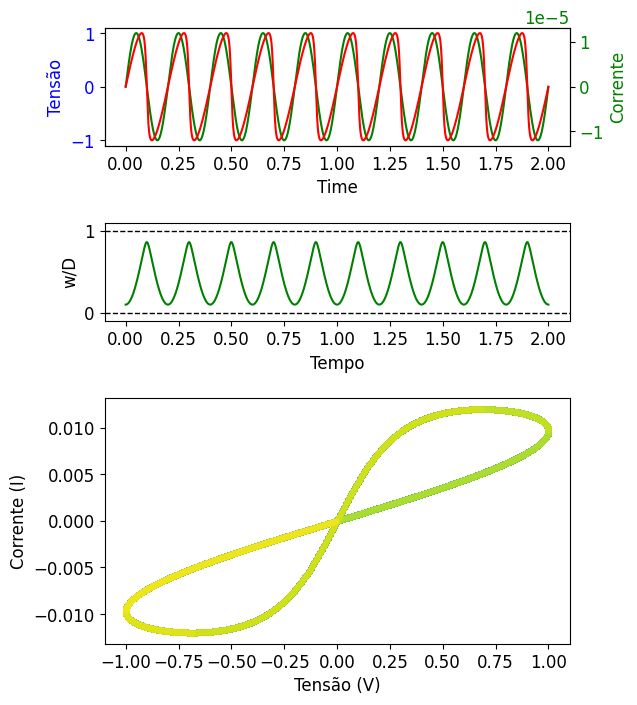

O programa exposto nesse repositório é fruto de um trabalho realizado para a disciplina de física computacional II, cursada na Universidade Federal do Rio Grande do Sul (UFRGS). Afim de exercitar os conhecimentos obtidos de simulação por métodos numéricos para resolução de equações diferenciais ordinárias.
O programa python desse repositório contém a simulação com os métodos runge-Kutta de quarta ordem (RK4), método multipasso de Adams-Bashforth (AB4) e método de passo variado adaptativo.
Para mais detalhes, leia a wiki do repositório.
Abaixo ilustramos o resultado final com leiaute semenlhante ao do artigo "The missing memoristor found".

