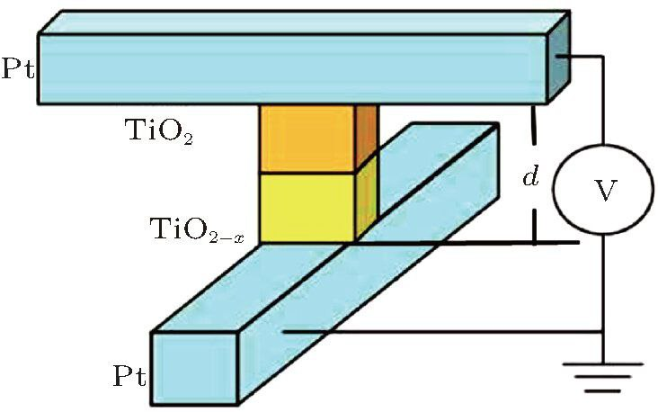
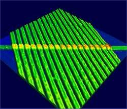
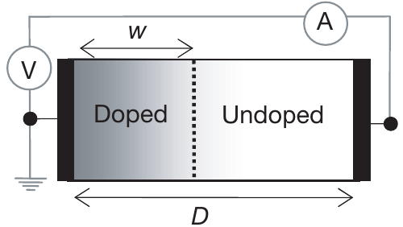

<!-- Isso é um hack para GitHub readme para usar latex: os scripts ficam "invisíveis" devido ao HTML -->
[comment]: <> ()
[comment]: <> ()

O programa exposto nesse repositório é fruto de um trabalho realizado para a disciplina de física computacional II, cursada na Universidade Federal do Rio Grande do Sul (UFRGS). Afim de exercitar os conhecimentos obtidos de simulação por métodos numéricos para resolução de equações diferenciais ordinárias.

## Introdução

A previsão do memristor por Leon Chua em 1971 representou um marco na teoria de circuitos elétricos. Baseado em argumentos de simetria matemática, Chua deduziu a existência de um quarto elemento passivo fundamental, complementando resistores, capacitores e indutores. Seu argumento baseia-se na análise das igualdades dos componentes conhecidos até então. São elas:

$$ \frac{dv}{di} = R \qquad \frac{dq}{dv} = C \qquad \frac{d\phi}{di} = L $$ 

Chua percebeu que as únicas variáveis fundamentais sem relação definida eram o fluxo magnético $\phi$ e a carga q. Assim, Chua postulou em componente que emergiria dessa situação, o \textbf{memristor}. A equação abaixo apresenta essa relação:

$$ \frac{d\phi}{dq} = M(q) $$

Sabendo que $$q = \int i\ dt\ $$ e que $$\phi = \int v\ dt\ $$, ainda podemos escrever a memristência na forma de:

$$ M(q(t)) = \frac{v(t)}{i(t)} $$

É importante frisar a diferença entre essa última equação e a definição de resistência em apresentada no início, que se dá no fato de que a resistência ser linear, tornando a tensão e a corrente dependentes entre si, enquanto o memristor é não linear, definida pelo histórico da carga (matematicamente $$q = \int i\ dt\ $$) que atravessa o componente. Justamente essa capacidade de "memorização" da passagem de carga através da alteração do seu estado de resistência que dá o nome do dispositivo.

Sua primeira realização prática ocorreu somente em 2008, por Stanley Williams e sua equipe na Hewllet-Packard (HP). A causa dessa demora é dada pelo fato do campo magnético não desempenhar um papel explícito no mecanismo de memresistência, fazendo os interessados pesquisarem nos materiais errados (STRUKOV et al., 2008; WILLIAMNS, 2008). O próprio desconhecimento desse mecanismo não era - e ainda não é - completamente compreendido. Mesmo que um resistor consiga alterar sua resistência conforme a passagem de corrente, ele precisa manter essa configuração de forma permanente até que a corrente flua novamente e haja a atualização na resistência - fenômeno conhecido como não-volatividade (VENTRA, PERSHIN, 2015).

Na pesquisa da HP foram produzidos filmes de óxido de 5nm, onde continha dióxido de titânio TiO2-x isolante e dióxido de titânio com uma ligeira depleção de átomos de oxigênio TiO2 condutor, ensanduichados entre dois eletrodos de platina de 5 nm de espessura e 50 nm de largura. Esses filmes foram montados na forma de ponto cruzado (crosspoint) ilustrada na figura \subref{fig:crosspoint}, para então gerar matrizes de barras transversais (crossbar array). Na figura 2 temos uma matriz 1x17 formada desses componentes. Essa configuração é mais próxima de uma aplicação comercial, pois aumenta a densidade do componente de memória.

  
   
  

    <strong>Figura 1: Estrutura do crosspoint</strong>
  

  
   
  

    <strong>Figura 2: Imagem feita em microscópio de força atômica, mostrando 17 memristores lado a lado (J.J. Yang, HP Labs, 2008)</strong>
  

Em 1976, chua e kang generalizaram o conceito de memristor para uma classe de sistemas dinâmicos chamada de sistemas memristivos, descritos pelo conjunto de equações:

$$
\begin{equation}
\begin{cases}
    v = R(w, i)i \\
    \frac{dw}{dt} = f(w,i)
\end{cases}
\end{equation}
$$

Onde w é uma váriavel de estado e R e f são funções explicitas no tempo. No entanto, passados 30 anos, não foi encontrado dispositivo físico que se aplica-se a matemática apresentada em \eqref{eqdifsis}. Contudo, mm 2008, pesquisadores da HP ao estudar materiais com espessura nanométrica, conseguiram conectar a teoria matemática aos dispositivos crosspoint estudados. Eles notaram que a passagem de corrente do terminal que continha o material condutor fazia com que os íons de oxigênio $O^{2-}$ movessem-se em direção ao terminal contrário, no sentido da corrente. Esse efeito de deriva iônica fazia com que os íons de carga negativa se adensassem próximo ao eletrodo. Ocorre que nesse processo há um a mudança na resistividade total do sistema, causada pela alteração na proporção de cada material em relação a largura total do memristor. Na realidade esse efeito não era novo, pois havia muito tempo que cientistas estavam atrás de explicações para anomalias na relação corrente-tenção, principalmente em materiais de filmes finos, só não havia vinculação com a hipótese dada por Chua.

Os pesquisadores adaptaram os resultados e modelaram no seguinte sistema memristivo:

$$
\begin{equation}
\begin{cases}
v(t) = (R_{on} \frac{w(t)}{D} + R_{off}(1 - \frac{w(t)}{D}))i(t) \\
\frac{dw}{dt} = \mu_{v}\frac{R_{on}}{D}q(t)
\end{cases}
\end{equation}
$$

Onde as variáveis são explicadas na tabela abaixo e a célula memristora ilustrada na figura :

<table style="margin: auto; border-collapse: collapse;">
  <caption style="font-style: italic; margin-bottom: 10px;"><strong>Tabela 1:</strong> Parâmetros Típicos de Memristores (STRUKOV et al., 2008)</caption>
  <thead>
    <tr style="border-bottom: 2px solid black;">
      <th style="padding: 8px; text-align: left;">Parâmetro</th>
      <th style="padding: 8px; text-align: left;">Descrição</th>
      <th style="padding: 8px; text-align: center;">Faixa de Valores</th>
    </tr>
  </thead>
  <tbody>
    <tr style="border-bottom: 1px solid #ddd;">
      <td style="padding: 8px;">$R_{\text{ON}}$</td>
      <td style="padding: 8px;">Resistência do material dopado (ON)</td>
      <td style="padding: 8px; text-align: center;">1 a 10 kΩ</td>
    </tr>
    <tr style="border-bottom: 1px solid #ddd;">
      <td style="padding: 8px;">$R_{\text{OFF}}$</td>
      <td style="padding: 8px;">Resistência do material não dopado (ON)</td>
      <td style="padding: 8px; text-align: center;">10 a 100 MΩ</td>
    </tr>
    <tr style="border-bottom: 1px solid #ddd;">
      <td style="padding: 8px;">$D$</td>
      <td style="padding: 8px;">Espessura da camada ativa</td>
      <td style="padding: 8px; text-align: center;">5 a 20 nm</td>
    </tr>
    <tr style="border-bottom: 1px solid #ddd;">
      <td style="padding: 8px;">$\mu_v$</td>
      <td style="padding: 8px;">Mobilidade iônica/voltagem</td>
      <td style="padding: 8px; text-align: center;">10−16 a 10−12 m2·V−1·s−1</td>
    </tr>
    <tr style="border-bottom: 1px solid #ddd;">
      <td style="padding: 8px;">V0</td>
      <td style="padding: 8px;">Tensão de operação</td>
      <td style="padding: 8px; text-align: center;">0.5 a 2 V</td>
    </tr>

    

  
   
  

    <strong>Figura 3: Esquemático da estrutura do memristor</strong>
  

oi oi 
